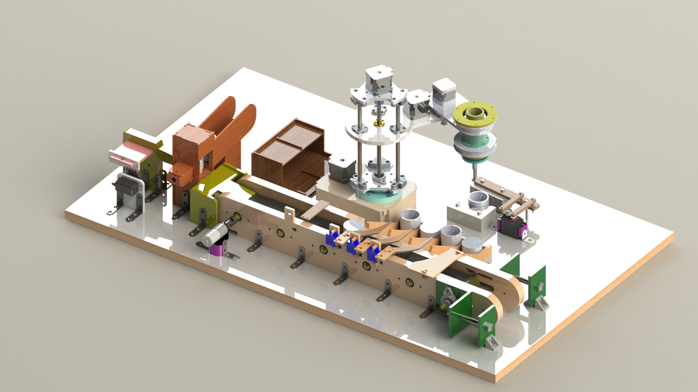

# 🤖 Automated Production Line with Sorting, Assembly, and SCARA Robot Arm

This repository features a fully integrated **automated production line** system that includes:
- 📦 Object detection and sorting by material
- 🔧 Mechanical assembly
- 🤖 A custom-built **SCARA robotic arm**
- 🧪 Hardware-in-the-Loop (HIL) testing using **MATLAB/Simulink**
- ⚙️ **Actuator sizing** and torque analysis for robotic motion

> Developed as a complete real-time mechatronics and control system.

---

## 🎯 Project Objectives

- Build a functional production line with material-based sorting and assembly
- Implement a 4-DOF SCARA arm to simulate robotic manipulation
- Use MATLAB/Simulink for Hardware-in-the-Loop (HIL) testing
- Perform actuator sizing based on torque and kinematic analysis
- Apply embedded control logic on Arduino hardware

---

## 🛠️ Hardware Components

- Arduino UNO / Mega
- DC motors with encoders
- Servo motors for sorting gates
- Stepper motors (SCARA arm joints)
- IR sensors
- L298N motor driver
- SCARA arm mechanical structure

---

## 🧠 System Description

The system workflow:

1. **Object Detection** using IR sensors on the input conveyor.
2. **Material Sorting** with a Camera + servo-based diverter.
3. **SCARA Robotic Arm** performs an assembly/pick-place task based on object position.
4. **MATLAB HIL Testing** sends and receives real-time feedback from the system to validate controller performance.
5. **Actuator Sizing** determines the required torque for each SCARA joint based on payload, link length, and speed.

---

## 🧪 MATLAB Hardware-in-the-Loop (HIL)

Using Simulink and MATLAB to:
- Simulate SCARA dynamics
- Run real-time HIL with Arduino via serial
- Verify controller performance with real hardware response
- Tune control gains dynamically

---

## ⚙️ Actuator Sizing

Using dynamic equations:
- Calculated joint torques based on SCARA kinematics
- Evaluated torque-speed requirements
- Selected stepper motor sizes accordingly
- Verified results in simulation and hardware

---

## 📹 Demo

🎬 *Watch our full system demo:*  
👉 (https://drive.google.com/file/d/1BODzzOaermqeXmFrEY9TpwEjlBdOvFp4/view?usp=sharing)

---

## 🚧 Challenges Faced

- Servo and stepper coordination with real-time constraints
- Managing timing delays during communication with Simulink
- Motor backlash and calibration
- SCARA arm precision and mechanical tolerances

---

## 🌱 Future Improvements

- Add feedback sensors to SCARA joints (encoders or potentiometers)
- Improve real-time communication (use Simulink External Mode or Serial)
- Expand to vision-based detection
- Use ROS-based control for modularity

